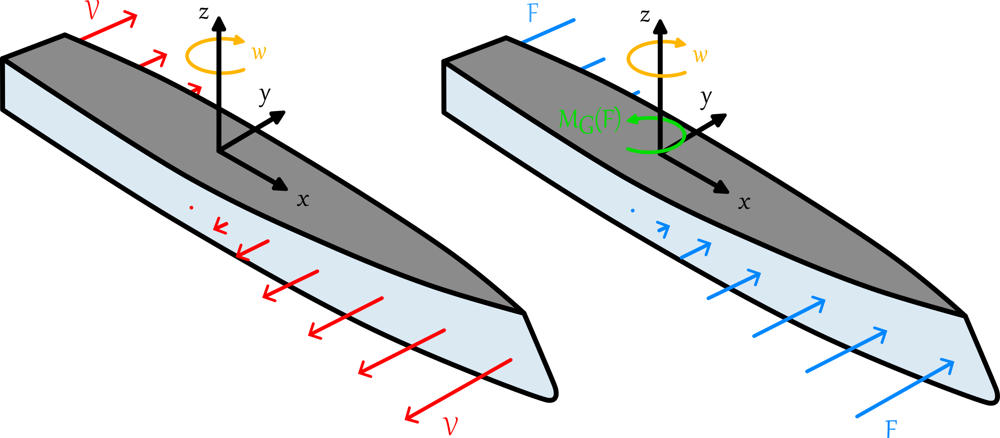

# Hydrodynamics

## Drag and lift coefficients

## Rotation coefficients

These coefficients are resulting from the forces created on the boat part when the boat rotates along it vertical axis. This creates different speeds on each point of the boat. It can be visualized on the figure below.

    

    Figure 1. Visualization of rotation resistance.

To take into account this rotation resistance, I decide to create a function representing the moment as a function of boat speeds and boat rotations. By definition,
$$\vec{M}_G(\vec{F}) = \vec{OG} \times \vec{F}$$ and $$\vec{F} = \int \int_S \sigma(x,y) dS$$ where $$\sigma(x,y)$$ is the stress on the wall related to the water pressure.  

Therefore, the goal here if to create $$\vec{M}_G(\vec{F}) = f(\vec{v}, \vec{\omega})$$.

### File format

## Appendices
