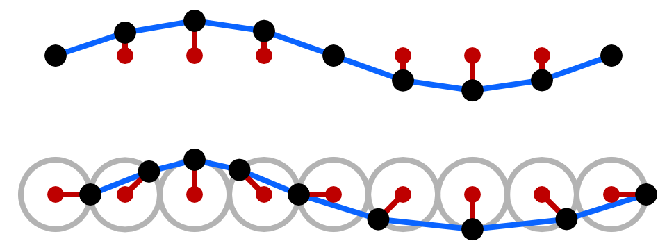

# Ocean

## Wave modelling
This work is based on the sources listed in the [references](#references) section at the end of the page.

### Wave elevation

To simulate the free surface elevation of the waves, I will use the Gerstner waves or trochoidal waves discovered by Gerstner in 1802, these waves are an exact solution of the Euler equations for periodic surface gravity waves with incompressible water. This solution combines computational performance and realism for offshore waves with infinite depth.  
The free surface of the flow is an inverted cycloid or trochoid as the figure below illustrate.

    

    Figure 1. Trochoidal waves by <a href="https://catlikecoding.com/jasper-flick/">Jasper Flick</a>

Mathematically, this free surface can be described in the 3 dimensions as follows[1](#references) :

$$\displaystyle
\vec{r}(x, y, t) = 
\begin{pmatrix}
\displaystyle x + \sum_i \left(Q_i A_i \times D_i \cdot x \times \cos(\omega_i D_i \cdot (x, y) + \varphi_i t) \right)\\
\displaystyle y + \sum_i \left(Q_i A_i \times D_i \cdot y \times \cos(\omega_i D_i \cdot (x, y) + \varphi_i t) \right)\\
\displaystyle \sum_i \left(A_i \times \sin(\omega_i D_i \cdot (x, y) + \varphi_i t) \right)
\end{pmatrix}
$$

Where
- $$Q_i$$ is a parameter that control the steepness of the waves. $$Q_i = 0$$ means no steepness, so the result is a regular sine waves composition;
- $$A_i$$ is the amplitude of the waves;
- $$D_i$$ is vector that control the directionality of the waves. $$D_i = 0$$ means unidirectional waves;
- $$\omega_i$$ is the angular frequency.

In this set of equations, it's important to note that $$r_x$$​ is not equivalent to $$x$$. These equations delineate both the vertical displacement and lateral motion of a specific point within the scene as *Figure 1* describes.  

Q must be adjusted with caution. If Q exceeds a certain value, the waves could loop back on themselves, which would break the physical sense of the waves, see *Figure 2* below.  

    

    Figure 2. Wave loops by <a href="https://catlikecoding.com/jasper-flick/">Jasper Flick</a>

### Wave speed

The speed of the wave is given by the dispersion relation : $$\displaystyle c^2 = \dfrac{g}{k}$$ where $$k = \dfrac{2\pi}{\lambda}$$ is the wave number and $$\lambda$$ wavelength. We know that $$\omega = kc$$, so the angular frequency can be defined as follows:  

$$\displaystyle \omega = \sqrt{\dfrac{2 \pi g}{\lambda}}$$

Where $$g$$ in the gravitational constant.

## References

- [1] Fernando Randima (2004), *GPU Gems: Programming Techniques, Tips and Tricks for Real-Time Graphics*, Pearson Higher Education (isbn: 0321228324)
- [2] Wikipedia (2023), *Trochoidal wave* [https://en.wikipedia.org/wiki/Trochoidal_wave](https://en.wikipedia.org/wiki/Trochoidal_wave)
- [3] Jasper Flick (2018), *Waves* [https://catlikecoding.com/unity/tutorials/flow/waves/](https://catlikecoding.com/unity/tutorials/flow/waves/)