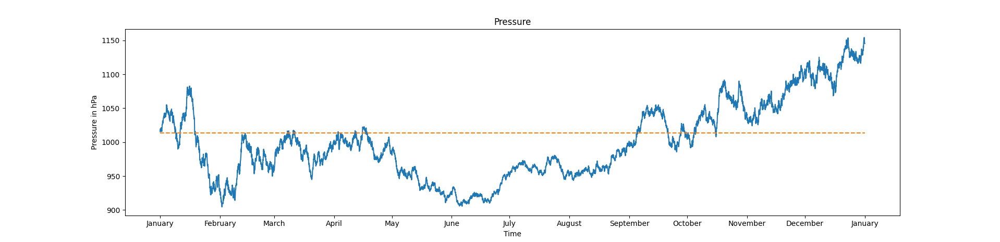
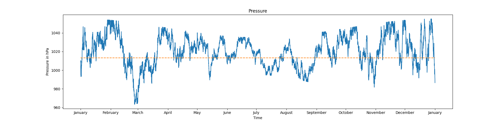
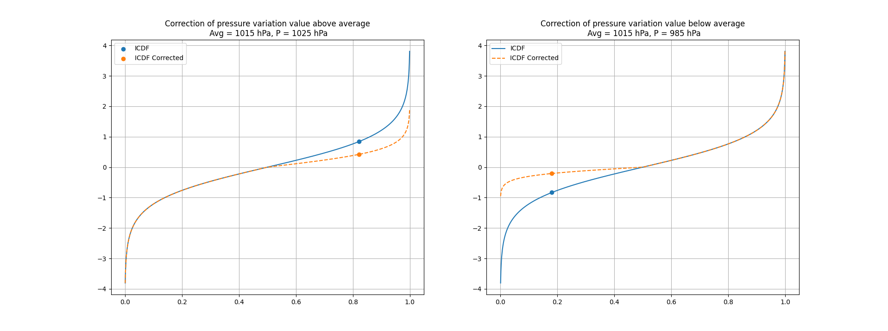
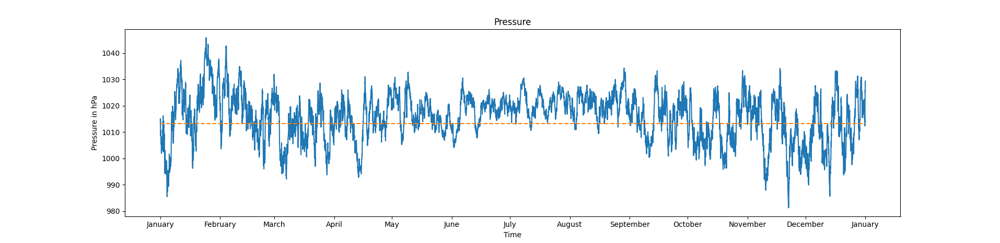
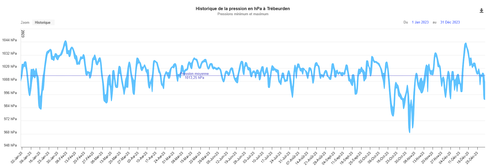

# Weather

To simulate the weather, I will consider a statistical approach defining multiple probability functions to predict the weather randomly and based on the previous weather states.

To define these function, I could have used the Hermite interpolation which interpolate a function by knowing the value and the derivative in all considered point.  


The first idea I had was to simulate each independent variables such as pressure, temperature and precipitation with different continuous functions. These functions would have been based on average, maximal and minimal value for each month. Monthly averages permits simulating properly the different seasons.

## Solution explored
### Pressure
My first goal was to find a distribution that is continuous where the inverse cumulative distribution function also known as the quantile function is enough simple to be computed rapidly, and the probability function is defined by a bell shape. The [Gaussian distribution](https://en.wikipedia.org/wiki/Normal_distribution) (also called the normal distribution) is the first choice I explored, but the quantile function is awfully complicated to compute. The [Cauchy distribution](https://en.wikipedia.org/wiki/Cauchy_distribution) could be an alternative, but the variance is undefined whereas it is an important parameter for us. The [Gompertz distribution](https://en.wikipedia.org/wiki/Gompertz_distribution) is asymmetric, and the variance is complicated to be expressed from the two parameters of the distribution.  
Even if the variance was quite complicated to be computed, the asymmetry of the function would enable to express correctly the pressure which is not centred around the average, for instance, the average value is about $$1013~hPa$$ and the minimal and maximal are respectively about $$960~hPa$$ and $$1050~hPa$$. My initial goal was to call the quantile function to have a probable state of pressure. The main problem of this method is the randomness of the generated pressure, indeed, the generated value is independent of the previous ones which gives crazy results... 

Therefore, I radically change the method. Instead of trying to simulate the pressure at each instant by calling a function, I compute the variation of pressure. By doing this, the previous pressure are taken into account. Unfortunately, I need to change the distribution function.  


After reviewing most of the distribution existing, my choice stopped on the [logistic distribution](https://en.wikipedia.org/wiki/Logistic_distribution). This distribution is based on two parameters $$\displaystyle \mu$$ and $$\displaystyle s$$. Mean and variance are easily defined from these two parameters, the quantile function is easy to compute and given by:

$$\displaystyle x(p) = \mu + s \log(\dfrac{p}{1-p}) , ~~~~ \forall p \in ]0, 1[$$ 

where the [mean](https://en.wikipedia.org/wiki/Expected_value), [median](https://en.wikipedia.org/wiki/Median) and [mode](https://en.wikipedia.org/wiki/Mode_(statistics)) is equal to $$\displaystyle \mu$$ and the [varaince](https://en.wikipedia.org/wiki/Variance) is given by $$\displaystyle \dfrac{s^2 \pi^2}{3}$$. Inversing the variance and we have $$s$$ as a function of the variance $$\displaystyle s = \dfrac{1}{\pi} \sqrt{3 v}$$.

In this case variance gives the amplitude of the modification of the pressure at each time step. See figure below showing the first attemp.

<p align="center">
    
</p>
<p align="center">
    Figure 1. First attemps, one year pressure simulation.
</p>

The orange dashed is the average pressure $$1013~hPa$$. We can se that the simulation is far from reality, the highest pressure here is around $$1150~hPa$$. A such high pressure has never been mesured on earth. As a reminder, the lowest atmospheric pressure ever mesured was $$870~hPa during the Typhoon Tip in $$1979$$ in the Western Pacific and the highest ajusted-to-sea level was $$1084.8~hPa$$ in 2001 in Mongolia.  

Here, there is a problem of limits so let's constraint theses value between maximum and minimum pressure, it give the figure 2.  

<p align="center">
    
</p>
<p align="center">
    Figure 2. Second attemp, one year pressure simulation.
</p>

On this second attemp, we can clearly se the limits which is not very convinient.
To tackle this issue, I made the logistic distribution asymmetric by definig a corrective coefficient which represent how far we are from the average pressure.

```python
dP = icdf_ll(r, 0, sp)

if dP <= 0:
    corrector = (pressure - minPressure)/(avgPressure - minPressure)
elif dp > 0:
    corrector = (maxPressure - pressure)/(maxPressure - avgPressure)

correctedDP = dP * min(1, c)

pressure += correctedDP
```

The later transform the quantile function of the logistic ditribution from the blue curve to the orange one on figure below.

<p align="center">
    
</p>
<p align="center">
    Figure 3. Corrected quantile functions against basic one.
</p>

With words, when values approach their maximum, the impact of further variation diminishes.

Results of this method are shown figure 4. with a comparison of a pressure records at Raden in Trébeurden, Brittany for 2023 Figure 5..

<p align="center">
    
</p>
<p align="center">
    Figure 4. Third attemp and final results, one year pressure simulation.
</p>
<p align="center">
    
</p>
<p align="center">
    Figure 5. Historical pressure record in 2023 at Raden in Trébeurden, Brittany.
</p>


## Retained solution

I need a value to add or substract from the current pressure, this value must be determined by how far we are from the mean pressure associated with it standard deviation.
