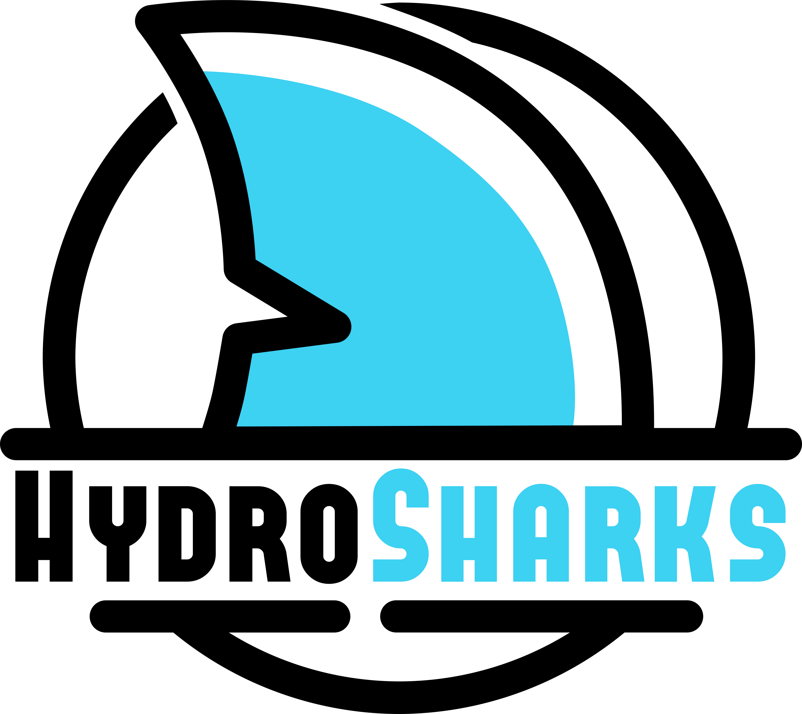
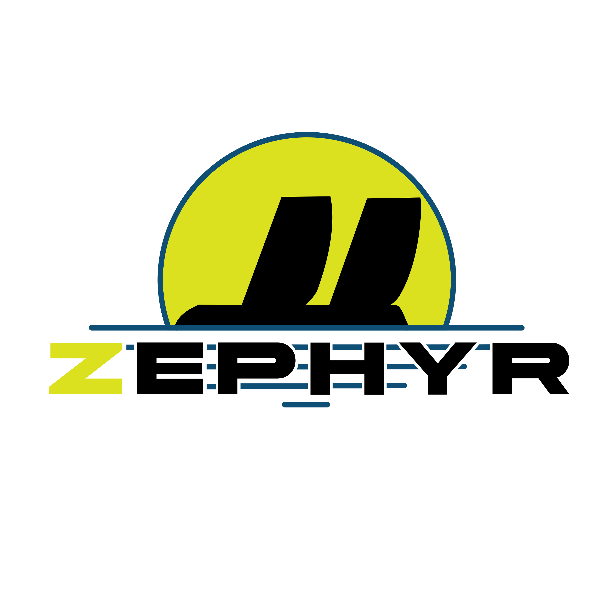
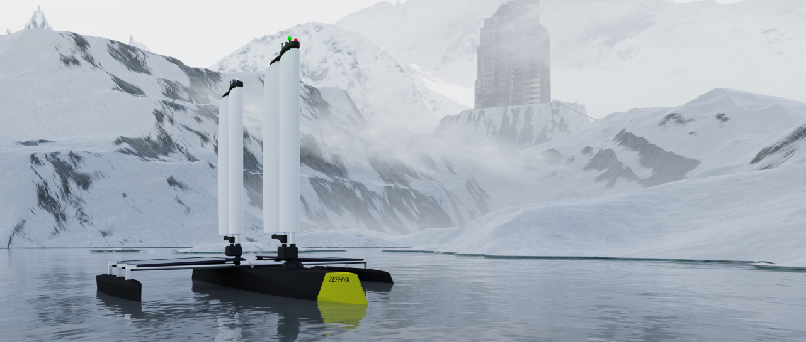

# Simulation of a boat in real time

This is the goal of Hydro'Sim

This work was conducted as part of the Zéphyr project, which is led by HydroSharks, the student ship-building association at the SeaTech engineering school.

    

The Zéphyr project involves the design and construction of an autonomous research trimaran powered solely by wind. Equipped with two rigid sails, the Zéphyr, as the trimaran is named, measures 4.7m by 3.2m with a height of 3.8m. It is fully dismountable, from the bow to the rudder, including the sails, allowing for easy transportation. The two rigid sails, composed of a main plane and a flap, enhance its wind capture and manoeuvrability in all conditions. Its design and dismountable capability also provide great versatility for the various missions it will undertake.

    

Want to comment?

