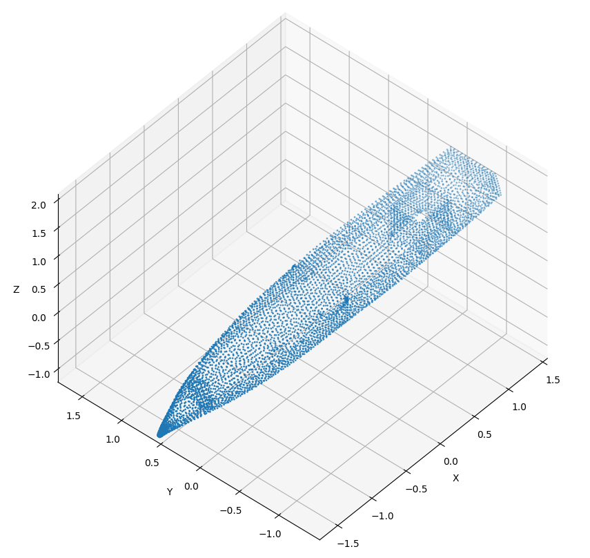
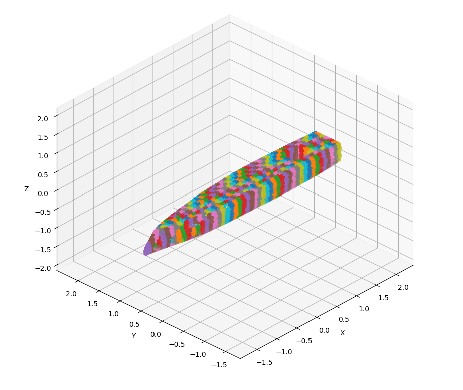
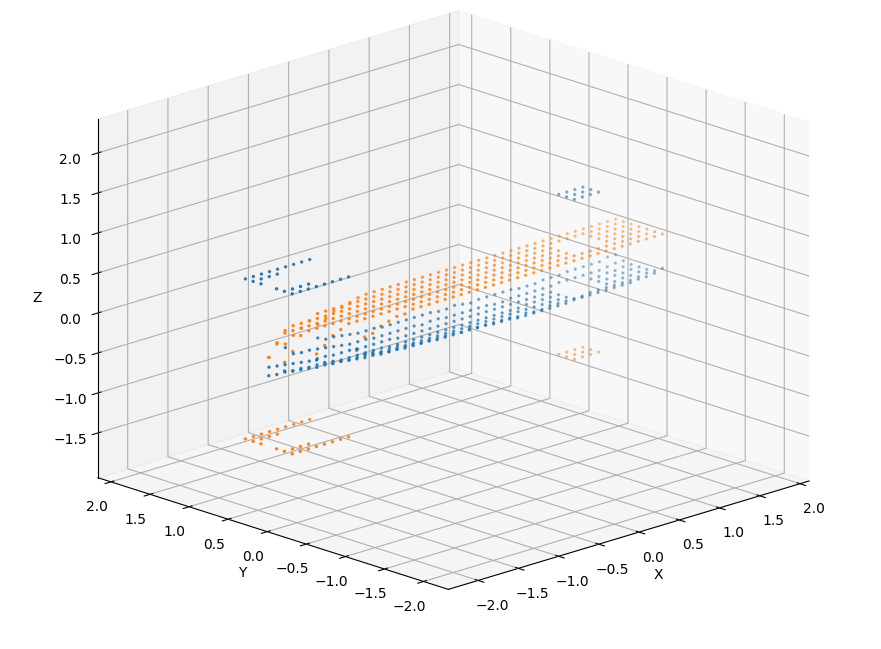

# Buoyancy and gravity

## Buoyancy

To implement the buoyancy using the method developed in the [theory section](../Physics/Buoyancy.md). I created a python script that read a stereolithography file *.stl*. In such a file, the information stored are oriented faces composed of 3 vertices.

```
facet normal -0.295816 -0.927877 0.227017
  outer loop
    vertex -1977.424455194792 -49.76801649301494 370
    vertex -2009.073043694378 -57.22589978187018 298.2778646447426
    vertex -1996.000295828976 -61.5479559349311 297.6470409675482
  endloop
endfacet
```
*Extract of the information stored in an .stl file*

After reading all the faces, I extract all single point of the file - points are attached to several faces, therefore in *.stl* file there is a lot of repetition. Here I extract over $$6,000$$ different points, see figure below.

<p align="center">
    
</p>
<p align="center">
    Figure 1. Points of the Zephyr hull
</p>

Now all the point are extracted, I subdivide the boat uniformly $$n$$ times along $$x$$ and $$m$$ times along $$y$$, this operation gives a grid $$n \times m$$ starting point for virtual boxes. Each box starts from the lowest point of the hull minus an offset and go up to the highest point of the hull plus an offset. Here, the boat measuring $$0.58 m$$ in height, I choose virtual boxes of $$0.6 m$$. 

<p align="center">
    
</p>
<p align="center">
    Figure 2. Zones of the Zephyr hull, each color represent a zones containing several points.
</p>

Here, there is no knowledge of the volume of each separated zones, then I used a ray-casting method to determine if a point is inside the hull, the proportion of point in the hull for each box approximate the true volume of each box. Moreover, the bottom and top $$z$$ coordinate of boxes aren't correctly defined so, in the same time as calculating the volume, I also corrected the height of each box. This gives the figure 3.

<p align="center">
    
</p>
<p align="center">
    Figure 3. Finding top and bottom coordinate of each box to approximate the volume of the Zéphyr hull.
</p>

```note
Some points aren't following the hull, like those at the front of the boat or in the sensors bay, it means that no point inside these boxes are inside the hull, their volumes are null.
```

The corrected heights are named $$Y_min$$ for the bottom ones and $$Y_max$$ for the top ones. Densities of boxes are assigned by spreading the weight given by the user, in the program, uniformly into the whole volume.


## Ray-casting method

As written in the precedent part, I created $$n \times m$$ boxes of $$0.6 m$$ in height, here $$n = 47$$ and $$m = 7$$. The dimensions of the boat being $$4.7$$x$$0.69$$x$$0.58$$, $$329$$ $$10$$ by $$10 cm$$ have been created. After subdividing each box with a resolution of $$1 cm$$, creating $$6,000$$ other points per box, we compute for each point of the subdivision if a collision occurs between the shot ray and the all the point of the hull contained in the zone where the box is, see visualization below.

<p align="center">
    
</p>
<p align="center">
    Figure 4. Visualization of a point shooting ray to determine if it is inside the hull or outside.
</p>


## Saving information

Now all volumes are computed, these data must be easily transferred to Unity. For that, I use a simple text file.

```warning
Axis in Unity are $$x$$ for the surge direction, $$y$$ for the heave direction and $$z$$ for the sway direction.
```

### File format

The file must have this format to be correctly interpreted by the reading function in *C#* :

***File.txt***
```
# NB_LINE_PER_DATA
386

# COORDINATE, VOLUME, DENSITY
X_0,Ymin_0,Z_0,Ymax_0,V_0,D_0
...,...,...,...,...,...
X_385,Ymin_385,Z_385,Ymax_385,V_385,D_385
```

### Modifying densities
Comma separated variable allow to modify densities easily using the *autofilter* function in common spreadsheets.

```note
A possible development for the future would be to automate the process with a function in the program.
```
